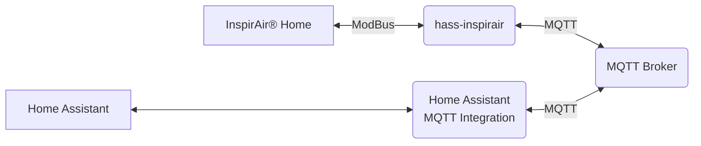
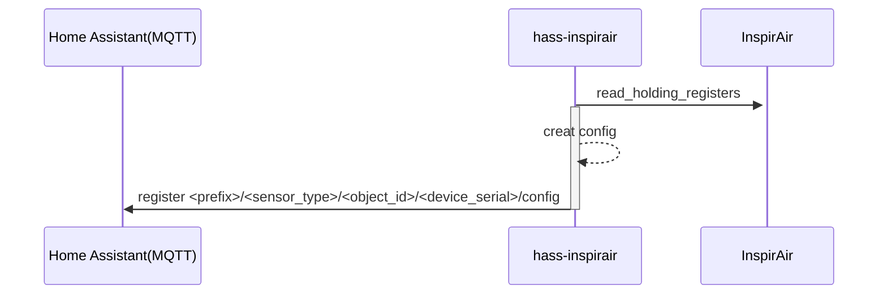
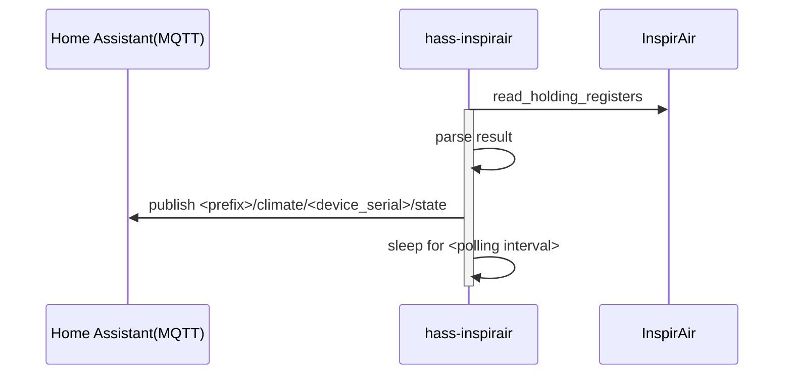
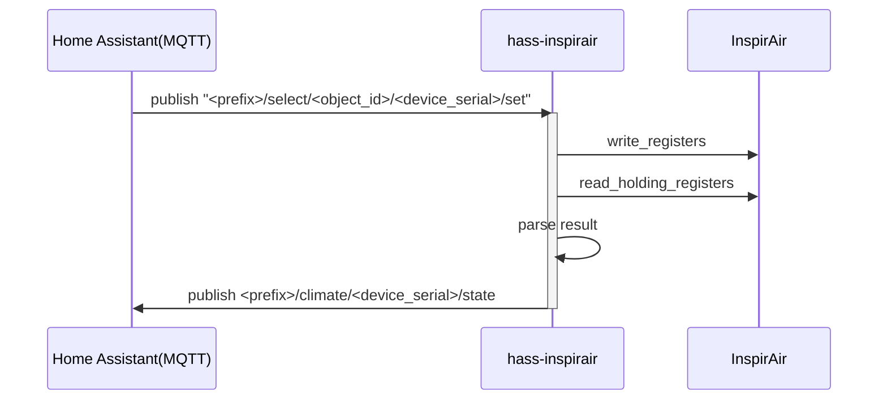
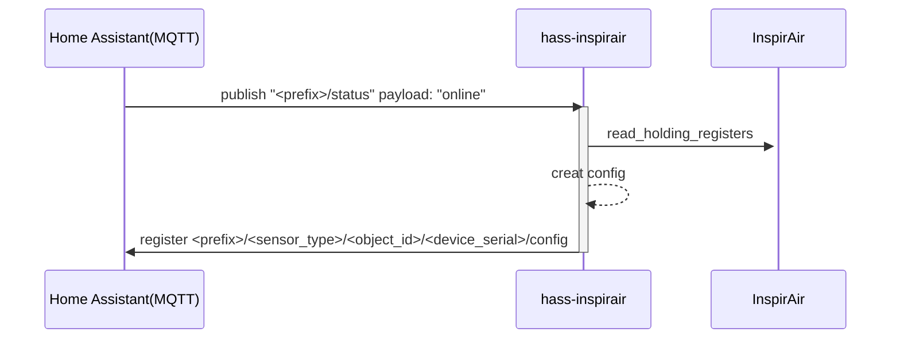

# hass-inspirair


[](https://www.python.org)
[](https://www.python.org)
[](https://www.python.org)
[](https://www.python.org)

[](https://github.com/pre-commit/pre-commit)


A python application that connects to the ventilation system `InspirAir® Home` from `Aldes` via ModBus and exposes it as a device for [Home Assistant](https://www.home-assistant.io/) .

<details>
<summary>Schematics of dataflow</summary>



</details>

Only the ventilation mode is currently writable. However, it takes some time before the value changes after a write command.
Since the register will stay at its previous value until the target state is reached.

Following features are implemented:

<details>
  <summary>1. Register after starting up</summary>
  

</details>

<details>
<summary>2. Continues updates</summary>



</details>

<details>
<summary>3. React on Home Assistant Inputs</summary>



</details>

<details>
<summary>4. React on Home Assistant MQTT lifecycle events</summary>



</details>

## Supported Models

In theory this application should work with any `InspirAir® Home` Ventilation system.

Currently, only the following was actually tested:

- InspirAIR Home SC 370

## Usage

Configure a `config.ini` file based on your requirements.
See [config.ini](./config.ini) for configuration options which can also be set via environment variables [(see env_config.py)](./hass_inspirair/env_config.py).

```bash
pip intall hass-inspirair
ha-inspirair -c ./config.ini
```

For are more exhaustive usage tutorial see [docs/tutorial/README.md](docs/tutorial/README.md).

## Simulator/Testing

The compose stack includes a simulator that exposes the relevante registers via Modbus-TCP. The presented values are a pure mock.
However, this stack can be used to try out the behavior of the MQTT discovery.

1. Run `docker-compose up`
2. goto [http://localhost:8123](http://localhost:8123)
3. Setup a user
4. Add the MQTT Integration (`host=mqtt`, no further credentials)
5. A device should show up
