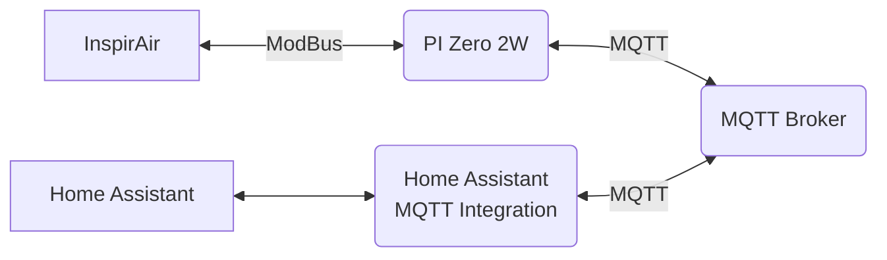

# Example Usage Tutorial

This document demonstrates an example how this library can be used using a Pi Zero 2W and a USB RS485 interface.

## Workflow



## Required Materials

Assuming a ventilation system like `Aldes InspirAir Home SC 370` is already in place and
[Home Assistant](https://www.home-assistant.io/) is running and the [MQTT](https://www.home-assistant.io/integrations/mqtt/) integration is [configured](https://my.home-assistant.io/redirect/config_flow_start?domain=mqtt) and running.

| Component                                         | Price (ca.) |
| ------------------------------------------------- | ----------- |
| [Pi Zero 2W](https://amzn.to/42ITjqZ)             | ~26 €       |
| [Pi (Case, USB adapter)](https://amzn.to/3uKeah1) | ~10 €       |
| [16 GB SD Card](https://amzn.to/3wsAY5q)          | ~5 €        |
| [Micro USB Powersupply](https://amzn.to/3uzMoE7)  | ~10 €       |
| [USB to RS485](https://amzn.to/3OMGaHO)           | ~19 €       |
| Some wires                                        |             |
| **Total**                                         | ~70 €       |

## Setup

1. Setup PI https://www.raspberrypi.com/software/
2. Install python `sudo apt-get update && apt-get install python3 python3-pip`
3. hass-inspirair `pip install hass-inspirair`
4. create and edit `config.ini`

```ini
[mqtt]
host: <host>
username: <username>
password: <password>
```

5. Setup a systemd service

```bash
chmod 600 config.ini # ensure nobody else can ready your password ;)
echo  "
[Unit]
Description=Home Assistant InspirAir
After=network.target

[Service]
WorkingDirectory=$(pwd)
User=$(whoami)
Group=$(whoami)
Type=simple
ExecStart=$(which ha-inspirair)
Restart=always

[Install]
WantedBy=multi-user.target
" > hass-inspirair.service

```

6. Validate `hass-inspirair.service`
7. Enable Service

```bash
cp hass-inspirair.service /etc/systemd/system
sudo systemctl enable hass-inspirair
sudo journalctl -u hass-inspirair
```

## After completing these steps a device should be recognized:


## Aditional

Since the default card looks a bit odd, I am using a [custom:simple-thermostat](https://github.com/nervetattoo/simple-thermostat) card:


<details>
<summary>Card Yaml</summary>

```yaml
type: custom:simple-thermostat
entity: climate.ventilation
layout:
  step: row
  mode:
    icons: true
    names: true
    headings: false
  sensors:
    type: table
    labels: true
sensors:
  - entity: sensor.ventilation_outdoor_air_temperature
    name: Zuluft
    decimals: 1
    unit: °C
  - entity: sensor.ventilation_indoor_air_temperature
    name: Abluft
    decimals: 1
    unit: °C

hide:
  state: true
  temperature: true
setpoints: false
control:
  fan:
    Ferien:
      icon: mdi:fan
    Standard:
      icon: mdi:fan-speed-1
    Boost:
      icon: mdi:fan-speed-2
    Gäste:
      icon: mdi:fan-speed-3
```

</details>
